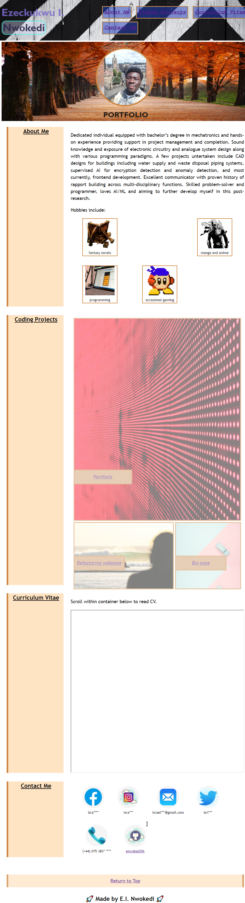

# enwokedi-s_portfolio
This repo contains my portfolio which details my educational background and extensive experience. 
It contains the following sections:  about me,  coding projects(specifically frontend projects), curriculim vitae and various contact channels.

PS: And while the current overview look sparse, more exciting projects and deployments will be added in the nearest future.

## Installation

Visit the live website [here](https://enwokedi96.github.io/horiseon_services).

## Usage

The screenshot of the webpage can be visualised here: 
    
## License

Link to license can be found [here](LICENSE.md).
