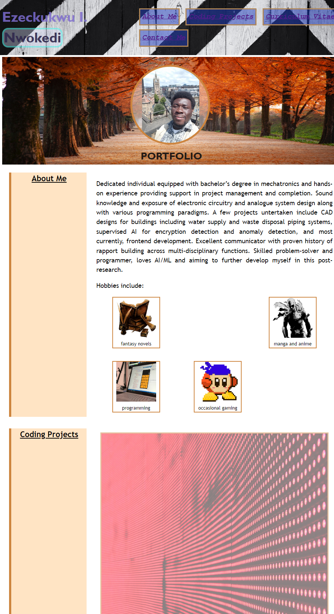
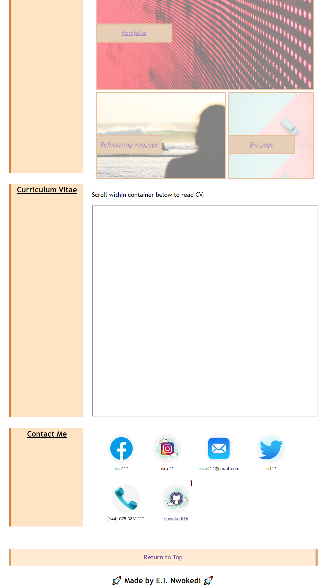

# enwokedi-s_portfolio
This repo contains my portfolio which details my educational background and extensive experience. 
It contains the following sections:  about me,  coding projects(specifically frontend projects), curriculim vitae and various contact channels.

PS: And while the current overview look sparse, more exciting projects and deployments will be added in the nearest future.

## Installation

Visit the live website [here](https://enwokedi96.github.io/enwokedi-s_portfolio/).

## Usage

The screenshot of the webpage can be visualised below: 

 

Top of the page provides navigation tools allowing user to easily access sections in the body and at the bottom, there is a return to top button.
The 'position' property is also set to sticky for section titles, allowing user to easily track current section while perusing. 
The works in the 'coding-projects' section all link to other deployed repos and once clicked are opened in a new tab. 
In addition, google doc containing cv was embedded in the 'curriculum vitae' section and is easily readable by in-frame scrolling.

The general webpage is made responsive when window is constricted to width of 600 pixels. All containing cells are 'flex'  enabled.
    
## License

Link to license can be found [here](LICENSE.md).
